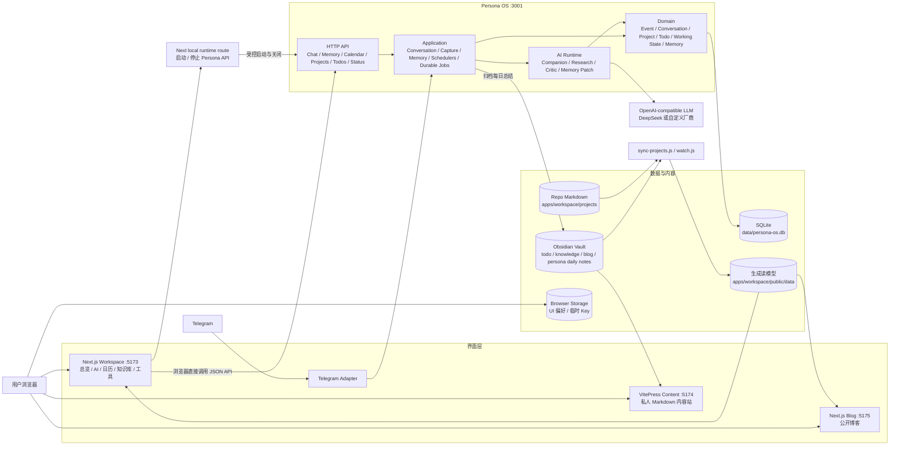
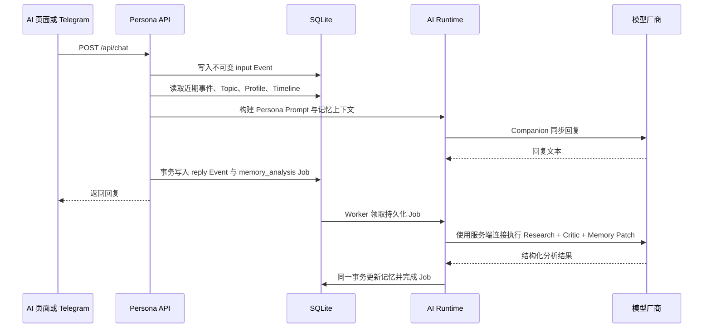
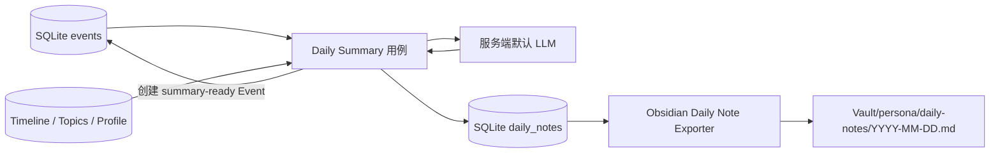
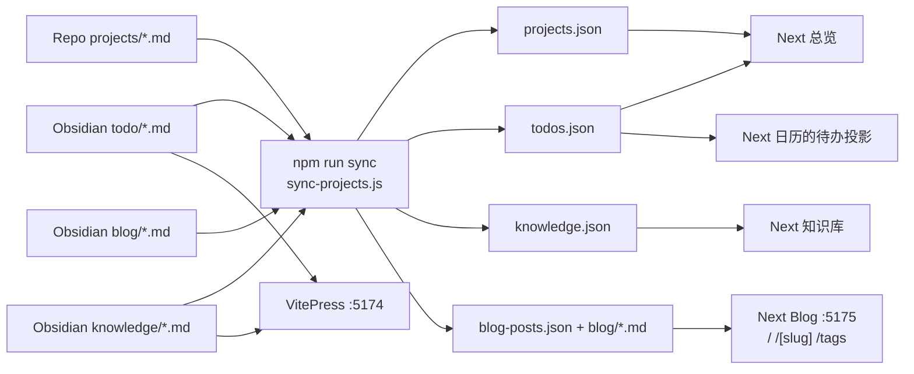

# Persona Workspace 当前架构

> 更新时间：2026-08-21
>
> 当前形态：本地优先的模块化单体，Next.js 工作台与 Persona API 分进程运行，Obsidian 作为内容库和人工审阅层。

## 1. 系统总览



系统不是微服务集群。开发时主要有四个本地进程：

- `:5173`：Next.js 主工作台，只承载工作区、AI 和工具模块。
- `:5175`：独立 Next.js 公开博客。
- `:3001`：Persona OS API、AI 编排、记忆与 SQLite 持久化。
- `:5174`：VitePress 私人内容站，按需启动。

## 2. 代码边界

| 层 | 位置 | 责任 |
| --- | --- | --- |
| Workspace 前端 | `apps/workspace/app/`、`apps/workspace/src/` | 工作台页面路由、统一侧栏、AI 控制台、日历、知识库和工具 |
| Blog 前端 | `apps/blog/app/`、`apps/blog/src/` | 独立公开博客列表、文章和标签页，运行于 `:5175` |
| Workspace 同步 | `apps/workspace/scripts/` | 从 Obsidian 和项目 Markdown 生成前端只读数据 |
| VitePress 内容站 | `apps/workspace/.vitepress/` | 直接浏览私人 Markdown 内容和本地全文搜索 |
| Persona 接口层 | `apps/persona/src/interface/` | HTTP API、CORS、本机运行时关闭接口、Telegram 适配 |
| Persona 应用层 | `apps/persona/src/application/` | 对话恢复、事件/会话查询、Capture、项目、待办、工作状态、记忆、日历、每日总结和快照调度 |
| Persona AI Runtime | `apps/persona/src/ai-runtime/` | Prompt、同步回复、异步分析、Memory Patch |
| Persona 领域层 | `apps/persona/src/domain/` | Event、Conversation Job、Analysis Job、Project、Todo、Working State、Memory Proposal、Topic、Profile、Timeline 规则 |
| Persona 基础设施 | `apps/persona/src/infra/` | SQLite、LLM、Obsidian 文件写入和环境配置 |
| 历史兼容资产 | `apps/workspace/legacy/` | 仅作迁移参考，不是当前入口 |

## 3. AI 与记忆闭环



### 核心约束

- 每条用户输入先写成 `events` 事实，再调用模型。
- `conversation_jobs` 为同步回复提供幂等、单飞、失败保留和人工重试；相同 Idempotency-Key 不会重复调用模型或生成回复。
- 原始 Event 不修改；Topic、Profile、Timeline 是可更新的记忆投影。
- 对话回复同步返回，Research/Critic/Memory Patch 由 SQLite 持久化任务执行，进程重启后继续。
- 任务使用租约、幂等键和最多三次退避重试；记忆写入和任务完成状态在同一事务提交。
- 记忆可以在前端查看、纠正、停用或恢复，修改操作仍保留来源 Event 审计关系。
- `POST /api/ai/test` 只测试连接，不产生对话 Event，也不写记忆。
- 服务端默认支持 DeepSeek 和 mock；网页自定义连接通过 OpenAI-compatible endpoint、model、API key 接入其他厂商。
- 自定义 API key 只放当前标签会话的 `sessionStorage`，不写 `localStorage`、SQLite 或生成文件。
- 后台记忆任务只使用 `PERSONA_ANALYSIS_*` 或服务端默认连接，不继承浏览器临时 Key。
- Capture 等无需同步回复的输入使用可审计 `analysis_jobs`；有序提交守卫避免并发分析把较旧画像覆盖到较新状态。
- 低置信度画像更新进入 `memory_proposals`，经接受或拒绝后再改变长期画像。

## 4. 每日总结与 Obsidian



- 总结按 `PERSONA_TIME_ZONE` 计算自然日。
- 生成结果先持久化到 `daily_notes`，并创建对应 Event。
- 归档时只维护 Markdown 中的 `PERSONA:DAILY_NOTE` 管理块，用户写在管理块外的内容会被保留。
- 文件写入使用路径校验、冲突检测和原子替换，避免越界写入或覆盖人工笔记。
- Persona 向 Obsidian 的自动写入目前仅用于 Daily Note；知识、待办和博客仍以人工 Markdown 为源。
- Daily Summary 与 Persona Snapshot 均有 SQLite 运行记录和可恢复调度器；快照只维护 Obsidian 中受控的 Persona 管理块。

## 5. Obsidian、知识库与博客数据流



`npm run watch` 会监听项目、todo、knowledge 和 blog Markdown，变更后重新生成 `apps/workspace/public/data/`。生成的 JSON 与博客 Markdown 副本是前端读模型，不是主数据；需要修改内容时应回到对应源 Markdown。

VitePress 直接使用 Obsidian Vault 作为 `srcDir`，用于私人内容浏览。公开博客不再由 VitePress 或 Workspace `:5173` 渲染，而由独立 Next.js 进程 `:5175` 的 `/`、`/[slug]` 和 `/tags` 提供。

## 6. 数据存储清单

| 数据 | 实际位置 | 权威级别 | 主要写入者 | 主要读取者 |
| --- | --- | --- | --- | --- |
| 对话事实与系统事件 | `data/persona-os.db` 的 `events` | Persona 事实源 | Persona API | 对话、状态、每日总结、记忆分析 |
| Topic 记忆 | SQLite `topics` | 运行时投影 | Memory Patch、用户状态操作 | Prompt、记忆页、每日总结 |
| 用户画像 | SQLite `profile` | 运行时投影 | Memory Patch、用户纠正 | Prompt、记忆页 |
| 时间线记忆 | SQLite `timeline_events` | 运行时投影 | Memory Patch | Prompt、记忆页、每日总结 |
| 每日总结 | SQLite `daily_notes` | 运行时记录 | Daily Summary 用例 | 工具页、归档流程 |
| 日历事件与标签 | SQLite `calendar_events`、`calendar_tags` | 跨客户端事实源 | Calendar API | 桌面浏览器、手机浏览器、未来 Windows App |
| 后台任务 | SQLite `background_jobs` | 可恢复运行队列 | Conversation、Worker | 状态页、Worker、失败任务重试 |
| 对话恢复任务 | SQLite `conversation_jobs` | 回复执行状态 | Conversation API | 幂等重放、失败重试、会话历史 |
| 治理分析任务 | SQLite `analysis_jobs` | Capture 分析状态 | Capture、Analysis Runtime | 状态页、人工重试 |
| 项目与待办 | SQLite `projects`、`todos` | Persona 运行时事实源 | Project/Todo API、Capture 投影 | Prompt、工作状态、API 客户端 |
| 当前工作状态 | SQLite `working_state` | 单例运行状态 | Working State API | Prompt、状态页、跨端客户端 |
| 记忆提案与搜索 | SQLite `memory_proposals`、FTS5 `memory_search` | 治理记录与可重建索引 | Memory Runtime、用户审阅 | Prompt、记忆搜索 API |
| 调度运行记录 | SQLite `daily_summary_runs`、`persona_snapshot_runs` | 可恢复调度状态 | 两个 Scheduler | 健康检查、失败诊断 |
| Persona 每日笔记 | `${OBSIDIAN_VAULT_PATH}/${PERSONA_DAILY_NOTE_DIR}` | 人工可读归档 | Persona Exporter + 用户 | Obsidian、VitePress |
| 知识库 | `${OBSIDIAN_VAULT_PATH}/knowledge` | 内容主库 | 用户/Obsidian | 同步脚本、VitePress |
| 待办 | `${OBSIDIAN_VAULT_PATH}/todo` | 内容主库 | 用户/Obsidian | 同步脚本、VitePress、Next 日历只读投影 |
| 博客 | `${OBSIDIAN_VAULT_PATH}/blog` | 博客主库 | 用户/Obsidian | 同步脚本 |
| 项目资料 | `apps/workspace/projects/*.md` | 项目内容主库 | 用户/仓库 | 同步脚本 |
| 前端生成数据 | `apps/workspace/public/data/` | 可重建缓存 | 同步脚本 | Next.js Workspace 和 Blog `:5175` |
| AI 连接与生成参数 | `localStorage: persona-ai-settings` | 单浏览器偏好 | AI 设置页 | AI 页面 |
| 自定义厂商 API key | `sessionStorage: persona-ai-api-key` | 当前标签临时机密 | AI 设置页 | AI 请求 |
| 外观、快捷入口、侧栏收藏 | 浏览器 `localStorage` | 单浏览器偏好 | Workspace UI | Workspace UI |
| 服务端密钥和运行配置 | 根目录 `.env` | 本机配置 | 开发者 | Persona、同步脚本 |

SQLite 当前统一承载 Event、Conversation/Analysis Job、Project、Todo、Working State、Memory Proposal、Memory、Daily Note、Calendar、Background Job 和调度运行记录，并启用 WAL、外键与 FTS5。PostgreSQL、向量库和图数据库都不在当前运行链路中。

## 7. 当前前端模块

| 路由 | 功能 |
| --- | --- |
| `/` | 工作台总览、项目/待办摘要、快捷入口、日历摘要、知识摘要、每日总结 |
| `/ai` | 与 Persona 对话、查看服务状态 |
| `/ai/models` | 服务端或自定义厂商连接、模型参数、连接测试 |
| `/ai/memory` | Topic、Profile、Timeline 和来源审阅 |
| `/ai/settings` | 外观、AI 行为、本地 Persona API 启动与关闭 |
| `/calendar` | 月/周/日视图、事件 CRUD、自定义标签、搜索过滤、Obsidian 待办投影 |
| `/knowledge` | 独立知识库浏览页 |
| `/tools` | 运行诊断、内容站入口、Daily Summary 工具 |
| `http://127.0.0.1:5175/` | 公开博客列表 |
| `http://127.0.0.1:5175/[slug]` | 博客正文 |
| `http://127.0.0.1:5175/tags` | 标签聚合 |

所有允许的工作台页面共享 `ApplicationFrame` 与常驻左侧栏。侧栏核心入口为总览、AI、知识库、工具，底部只保留统一设置；工作台标识始终可返回首页。

## 8. Persona API 表面

主要接口如下：

- 对话与模型：`POST /api/chat`、`POST /api/ai/test`
- 运行状态：`GET /health`、`GET /ready`、`GET /api/status`
- Event 与会话：`GET /api/events`、`GET /api/conversations`
- Capture、项目、待办与工作状态：对应资源的查询、创建和状态变更接口
- 记忆：`GET /api/memory` 及 topics/profile/timeline/sources 子接口
- 记忆治理：Profile correction/state、Topic state 接口
- 每日总结：创建、列表、按日期读取和归档接口
- 日历：范围读取以及 Event/Tag 的创建、更新、软删除接口
- 后台任务：`background_jobs`、`analysis_jobs`、`conversation_jobs` 的状态统计、隐私安全元数据查询和手动重试接口
- Obsidian 快照：受控归档与自动调度接口
- 本机关闭：`POST /api/runtime/shutdown`

浏览器默认直接请求 `http://127.0.0.1:3001`。Next.js 的 `/api/persona/runtime` 只承担本地进程的健康检查、固定命令启动和受控关闭，不代理普通聊天数据。

## 9. 最近完成的工程工作

### 前端框架

- 将原先零散页面整理为 Next.js App Router 模块，建立统一 Workspace 外壳和常驻侧栏。
- 工作区精简为总览、AI、知识库和工具，设置独立放在侧栏底部。
- 新增知识库页、工具页和独立 `apps/blog` Next 博客进程，保留 VitePress 作为私人内容站。
- 主页移除 Persona 运行状态和记忆画像等重复面板，状态与记忆回归 AI 专属页面。

### AI 与运行控制

- 完成 AI 对话、模型、记忆、设置四个独立页面。
- 模型设置不锁死 DeepSeek，支持自定义 OpenAI-compatible endpoint、model 和临时 API key。
- 增加真实连接测试，以及网页内启动和关闭本地 Persona API 的能力。
- 完成基础记忆写回、来源审计、状态治理和每日总结到 Obsidian 的闭环。
- 合入对话幂等与恢复任务、Capture、项目/待办投影、工作状态、记忆提案、FTS 检索、事件/会话历史和 Persona Snapshot 调度。

### 日历与内容

- 重做日历为月/周/日完整工作视图，支持服务端事件增删改查、全天事件、备注、搜索和过滤。
- 自定义标签、事件和版本号进入 SQLite，多设备写冲突返回 `409`；旧浏览器日历键保持原样且不迁移。
- 点击日期只更新右侧日期检查器，不强制切换当前视图；主日历与右侧面板已视觉分离。
- Obsidian 待办以只读投影进入日历，博客 Markdown 同步到 `:5175` 的独立 Next.js 公开站。

## 10. 安全与部署边界

- 默认绑定 `127.0.0.1`，运行时启动/关闭接口只允许本机调用。
- Persona API 使用显式 CORS allowlist；Telegram 使用允许的 chat ID 列表。
- 远程 endpoint 必须为 HTTPS；本机开发 endpoint 可使用 loopback HTTP。
- `.env` 不进入前端构建，自定义 API key 也不持久化到长期浏览器存储。
- 当前没有面向公网的用户认证、租户隔离或权限系统，不应直接将 Persona API 暴露到公网。

## 11. 当前边界与后续方向

- Calendar 和记忆任务已服务端化；离线时保留本次已加载视图，但不接受离线写入队列。
- Obsidian 到 Workspace 的知识、待办、博客链路是单向生成；Persona 只反向写 Daily Note。
- 当前上下文检索基于近期 Event、结构化记忆与 SQLite FTS5，没有向量检索或完整 RAG。
- 服务端默认 provider 配置仍是 DeepSeek/mock；多厂商能力通过每次请求的 OpenAI-compatible 自定义连接实现。
- SQLite 适合当前单机 MVP；只有出现多用户、并发写入或远程部署需求时，才需要评估 PostgreSQL。

## 12. 常用启动命令

```bash
npm run dev:mock         # 一键启动 Workspace + 真实 Persona API（脚本名为历史遗留）
npm run dev              # Next.js Workspace :5173
npm run dev:lan          # Workspace 绑定 0.0.0.0，供局域网手机访问
npm run dev:blog         # 独立 Next.js Blog :5175
npm run dev:blog:lan     # Blog 绑定 0.0.0.0
npm run dev:backend      # Persona API :3001，真实模型
npm run dev:backend:mock # Persona API :3001，mock 模型
npm run dev:content      # 同步后启动 VitePress :5174
npm run sync             # 手动生成 Workspace 内容读模型
npm run build:blog       # 构建独立 Blog
npm run watch            # 监听 Markdown 并持续同步
```

当前 MVP 的最短闭环是：用户在网页或 Telegram 输入内容 -> Event 入 SQLite -> Persona 基于历史与记忆回复 -> 后台分析写回结构化记忆 -> 每日总结进入 SQLite -> 用户按需归档到 Obsidian。
