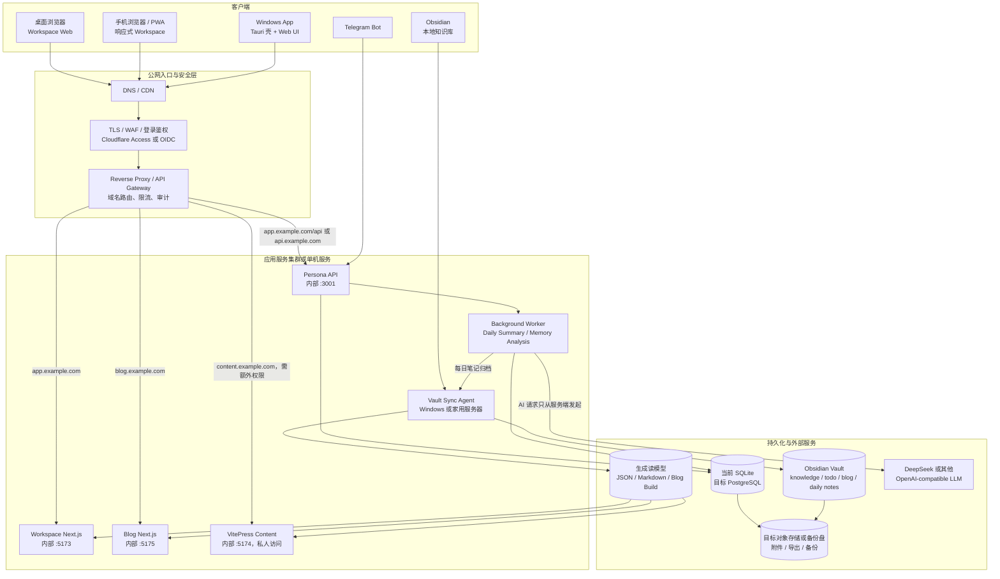
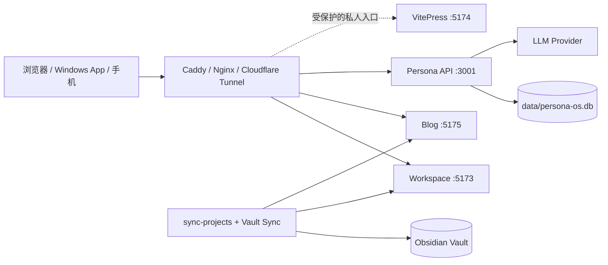
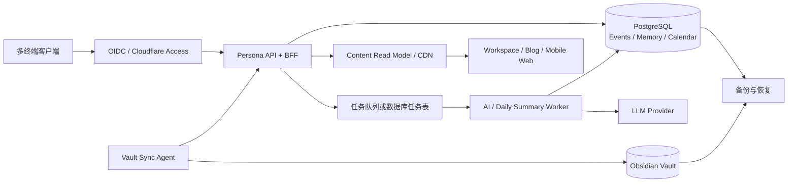
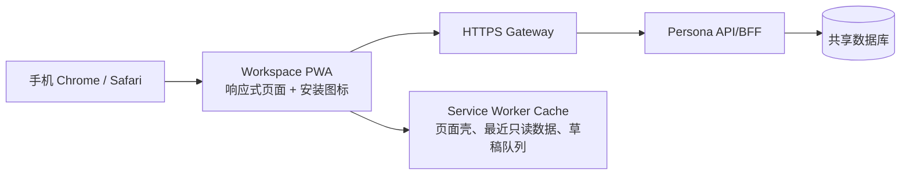
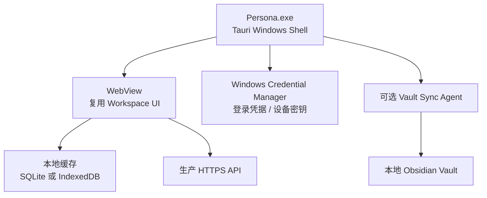
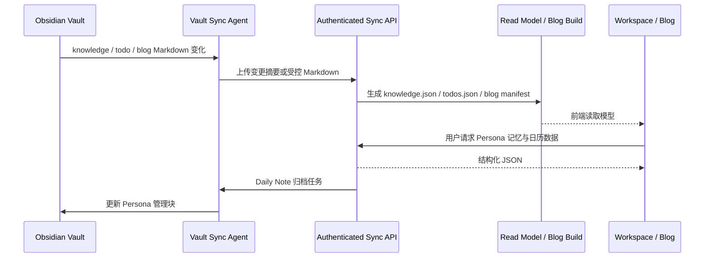
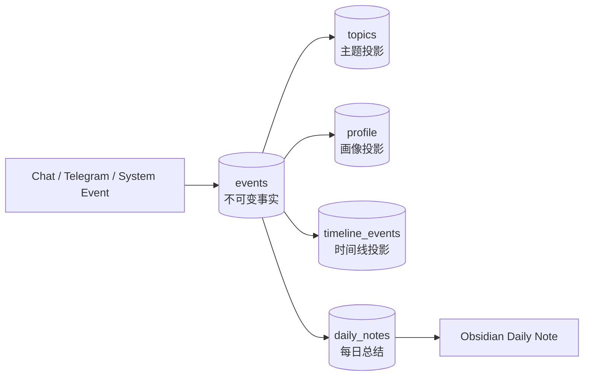
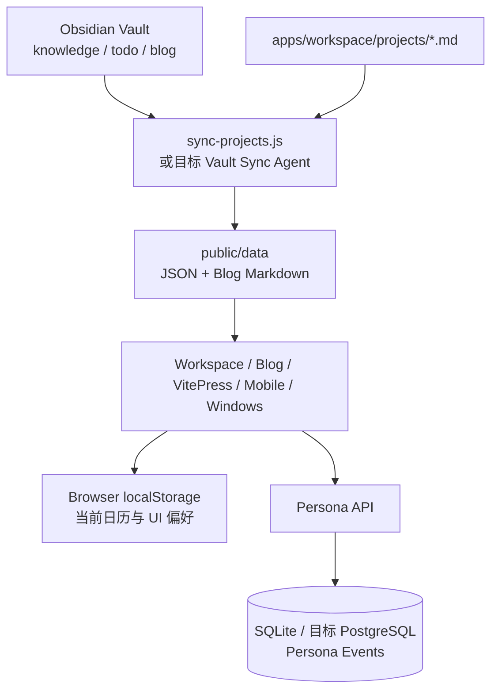
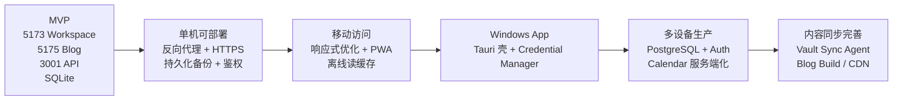

# Persona Workspace 部署与多终端架构

> 更新时间：2026-08-18
>
> 本文补充 `current-architecture.md`，专门说明部署后如何支持桌面浏览器、移动端、Windows App、博客和 Obsidian。文中标记为“当前”的内容对应仓库现状，标记为“目标”的内容是为了多设备和公网部署预留的架构。

## 1. 先看结论

项目应保持一个中心业务后端，所有客户端都通过受保护的 HTTPS API 访问 Persona，不允许移动端、Windows App 或公网浏览器直接访问 SQLite、Obsidian Vault 或 LLM 厂商。

```text
桌面 Web / 移动 Web(PWA) / Windows App / Telegram
                         |
                 HTTPS + 登录鉴权
                         |
        Gateway / Reverse Proxy / Cloudflare Access
             |              |               |
        Workspace        Blog          Persona API
          :5173          :5175             :3001
             |              |               |
       generated data   blog read model   SQLite/Postgres
                                             |
                                  AI Runtime + Memory
```

核心原则：

- 客户端只负责界面、交互、本地缓存和离线队列，不拥有 Persona 业务规则。
- AI Key、Telegram Token、数据库连接和 Obsidian 文件权限只存在服务端或受控同步代理。
- `5173` 是工作台，`5175` 是独立博客，`5174` 是私人内容站；这些是开发端口，不应直接作为公网安全边界。
- 生产环境通过域名和反向代理区分服务，外部用户不需要知道内部端口。
- 当前 SQLite 适合单机 MVP；多终端正式使用时，记忆和事件需要迁移到 PostgreSQL 或同等级共享数据库。

## 2. 总体部署图



## 3. 开发、单机部署和正式部署

### 当前开发模式

| 地址 | 服务 | 数据边界 |
| --- | --- | --- |
| `http://127.0.0.1:5173/` | Workspace Next.js | 工作台、AI 页面、日历、知识库和工具 |
| `http://127.0.0.1:5175/` | 独立 Blog Next.js | 公开博客首页、文章和标签 |
| `http://127.0.0.1:5174/` | VitePress | 私人 Obsidian 内容站 |
| `http://127.0.0.1:3001/` | Persona API | 对话、记忆、每日总结、状态 |

开发命令：

```bash
npm run dev:mock          # Workspace + Blog + Persona API
npm run dev               # 只启动 Workspace :5173
npm run dev:blog          # 只启动 Blog :5175
npm run dev:backend       # Persona API :3001
npm run dev:content       # VitePress :5174
```

### 当前可行的单机部署

单机部署可以把四个 Node 进程放在同一台 Windows 主机、家用服务器或 VPS：



此模式适合当前个人使用，但必须满足：

- 只公开反向代理端口，不能把 `3001`、SQLite 文件或 Vault 目录直接暴露到公网。
- `data/`、Vault 和生成读模型要放在持久化磁盘，并进行备份。
- Persona API 必须增加登录鉴权或置于 Cloudflare Access 后，不能依赖 `127.0.0.1` 保护公网服务。
- 生产环境的 `.env`、模型 Key 和 Telegram Token 应改用系统密钥存储或 Secret Manager。

### 多设备正式部署目标

当手机、Windows App 和多个浏览器都需要访问同一份记忆时，建议拆成以下逻辑组件：



目标部署中，`5173`、`5175`、`5174` 和 `3001` 只是服务内部监听端口；推荐的外部入口是：

| 外部入口 | 后端目标 | 访问策略 |
| --- | --- | --- |
| `https://app.example.com` | Workspace | 登录后访问，桌面和移动端共用 |
| `https://blog.example.com` | Blog | 可公开访问，文章只读 |
| `https://content.example.com` | VitePress | 私人访问，必须登录 |
| `https://app.example.com/api` | Persona API/BFF | 同源 Cookie 或 OIDC Token，禁止裸露 `:3001` |

Blog 可以使用独立域名，也可以使用 `https://example.com/blog` 的反向代理路径。内部仍保留独立 Blog 进程，以免公开内容和工作台发布节奏互相影响。

## 4. 客户端设计

### 桌面 Web

桌面 Web 是主客户端，继续使用当前 Next.js Workspace：

- `app.example.com` 进入工作台，统一侧栏、AI、知识库、日历和工具保持现有结构。
- 浏览器通过同源 API 或网关访问 Persona，不再在生产环境硬编码 `127.0.0.1:3001`。
- 记忆、事件和日历服务端数据由 API 返回；浏览器本地存储只保留主题、快捷入口、临时草稿和缓存。
- 博客通过 `blog.example.com` 或已配置的博客入口打开，不与工作台页面混在同一个生产进程中。

### 移动端

第一阶段不另起一套移动后端，直接使用响应式 Web 和 PWA：



移动端需要满足：

- 日历、AI 对话、记忆查看和每日总结在窄屏下保留完整闭环，不依赖 hover、拖拽或大屏侧栏。
- 只缓存页面壳和非敏感读数据；API Key、Telegram Token、数据库信息不进入移动端。
- 离线时允许查看最近缓存、编辑草稿和创建待同步日历操作；联网后由 API 处理幂等同步。
- PWA 的安装、推送和后台同步属于后续实现，不应在当前 MVP 中假装已经完成。

如果将来需要原生移动 App，可以用 React Native/Expo 或 Flutter 复用同一套 API 合同，但不新增一套 Persona 业务逻辑。

### Windows App

Windows App 推荐使用 Tauri，而不是把全部业务逻辑重新写一份：



Windows App 分两步：

1. 第一阶段只是 Tauri 壳，加载与 Web 一致的 Workspace，使用远程 HTTPS API；登录凭据放 Windows Credential Manager，本地只存缓存。
2. 第二阶段再增加本地 Vault Sync Agent、系统托盘、快捷键、通知和离线队列；这些属于桌面能力，不复制 Conversation、Memory 或 AI Prompt 逻辑。

Windows App 不应直接把用户的 LLM API Key 写入前端配置。所有模型调用优先走 Persona API；如果允许用户自定义供应商，生产环境应使用服务端加密存储和用户级连接配置。

## 5. Obsidian 与多设备同步

当前同步脚本默认读取本机 Vault 路径，这对本地开发足够，但手机和远程部署无法直接访问 Windows 的 OneDrive 路径。目标架构需要一个受控的 Vault Sync Agent：



同步规则：

- Knowledge、Todo、Blog 的 Markdown 仍然是内容主库；JSON、Blog build 和 CDN 内容都是可重建读模型。
- Persona 的 Event、Profile、Topic、Timeline 和 Calendar 在正式多设备模式下由共享数据库负责。
- Daily Note 由 Persona 生成，但写回 Vault 需要经过本机 Agent 或受控的服务器挂载。
- 同步必须有版本号、幂等键、冲突检测和失败重试；不能用浏览器直接写 OneDrive 文件。
- Blog 发布可以由同步成功触发构建，也可以使用定时构建；移动端和 Windows App 只读取博客站点。

## 6. 数据存储的当前状态与目标状态

### 6.1 当前实际目录布局

```text
项目根目录/
├─ data/
│  ├─ persona-os.db          Persona SQLite 主库
│  ├─ persona-os.db-wal      SQLite WAL 写前日志
│  └─ persona-os.db-shm      SQLite 共享内存文件
├─ apps/workspace/public/data/
│  ├─ projects.json          项目 Markdown 的生成读模型
│  ├─ todos.json             Obsidian todo 的生成读模型
│  ├─ knowledge.json         Obsidian knowledge 的生成读模型
│  ├─ blog-posts.json        博客索引生成物
│  └─ blog/*.md              博客正文生成副本
├─ apps/workspace/.next/     Workspace 构建缓存和产物，不是业务数据
├─ apps/blog/.next/          Blog 构建缓存和产物，不是博客源数据
└─ .env                      本机配置和开发密钥，不进入前端构建

仓库外部 Obsidian Vault/
├─ knowledge/                知识库 Markdown 主库
├─ todo/                     待办 Markdown 主库
├─ blog/                     博客 Markdown 主库
└─ persona/daily-notes/      Persona 每日总结的 Markdown 归档

浏览器单独存储：
├─ localStorage              主题、AI 参数、快捷入口、日历事件和标签
└─ sessionStorage             当前标签页临时保存的自定义模型 API Key
```

`apps/workspace/public/data/` 和两个 `.next/` 目录都可以删除后重新生成。真正不能当作缓存删除的是 SQLite、Obsidian Vault 和用户希望保留的浏览器日历数据。

### 6.2 SQLite 当前表和写入规则



Persona 使用 `better-sqlite3` 打开仓库根目录的 `data/persona-os.db`，启动时执行 `schema.sql` 和迁移，开启 WAL 与外键，并通过事务完成跨表写入。当前表的含义如下：

| 表 | 一行代表什么 | 关键字段 | 写入方式 | 删除/修改规则 |
| --- | --- | --- | --- | --- |
| `events` | 一条输入、回复、分析结果或归档事实 | `id`、`source`、`type`、`payload`、`timestamp`、`metadata` | 对话入口先写入，系统流程追加 | 原始事实不修改，使用追加事件纠正 |
| `topics` | 一个可持续更新的主题记忆 | `name`、`summary`、`related_topics`、`message_count`、`state` | Memory Patch 或用户状态操作 | 通过 `active/archived/suppressed` 状态治理，保留 `state_event_id` |
| `profile` | 一个画像键值事实 | `key`、`value`、`source_event_id`、`state` | Memory Patch 或用户纠正 | 不直接删除，使用状态和纠正事件 |
| `timeline_events` | 一个洞察、变化或里程碑 | `date`、`type`、`summary`、`source_event_id` | Memory Patch | 通过来源 Event 追溯 |
| `daily_notes` | 某个自然日的总结记录 | `date`、`summary`、`highlights`、`topic_distribution`、`archive_path` | Daily Summary 用例 | 总结可刷新，归档状态和归档 Event 单独记录 |
| `projects` | Persona 侧的结构化项目记录 | `name`、`status`、`topics`、`summary` | 后端项目投影能力 | 当前 Workspace 项目主库仍是 Markdown，不以此表替代 |

`payload`、`metadata`、`related_topics`、`highlights` 和 `topic_distribution` 当前以 JSON 文本存储；数据库中不存 Markdown 正文、模型 API Key 或 Obsidian 文件内容全文。前端不能直接打开 SQLite，只能调用 Persona API。

### 6.3 浏览器存储的具体归属

| 存储键 | 当前内容 | 是否跨设备 | 正式部署处理 |
| --- | --- | --- | --- |
| `persona-ai-settings` | 连接模式、endpoint、model、temperature、memory 开关等 | 否 | 非敏感默认配置可保留客户端，用户级模型配置应服务端加密保存 |
| `persona-ai-api-key` | 自定义厂商 API Key | 否，仅当前标签页 | 不同步、不上报日志；生产优先由服务端保存连接凭据 |
| `persona-calendar-events-v1` | 日历自建事件 | 否 | 迁移为 `calendar_events` 表，通过 API 同步 |
| `persona-calendar-tags-v1` | 日历自定义标签和颜色 | 否 | 迁移为 `calendar_tags` 表，通过 API 同步 |
| `persona-workspace-appearance` | 主题、色相、动效 | 否 | 继续保留本地，必要时同步到用户偏好 |
| `persona-home-quick-actions` | 主页快捷入口排序 | 否 | 继续保留本地，或作为用户 UI 偏好同步 |
| `persona-sidebar-favorites` | 侧栏固定入口 | 否 | 继续保留本地，或作为用户 UI 偏好同步 |

### 6.4 源数据、业务事实和生成缓存



判断某份数据能否删除时，按这个规则：

- Obsidian Markdown 和 `apps/workspace/projects/*.md` 是内容主库，不能把生成 JSON 当编辑源。
- `events` 是 Persona 的事实主库；Topic、Profile、Timeline 和 Daily Notes 是数据库内的结构化投影，但都保留 Event 来源。
- `public/data` 是可重建缓存，丢失后运行 `npm run sync` 恢复。
- `.next` 是构建产物，丢失后运行对应 build 恢复。
- 浏览器 `localStorage` 目前是日历自建数据的唯一位置，清空会丢失当前浏览器的自建日历事件，因此迁移到服务端前不能把它当普通缓存清理。

### 6.5 生产存储和备份

生产目标不是把所有文件都塞进 PostgreSQL，而是按数据性质分层：

| 存储层 | 保存内容 | 备份策略 | 恢复方式 |
| --- | --- | --- | --- |
| PostgreSQL | Events、Memory、Daily Notes、服务端 Calendar、用户配置 | PITR/WAL + 每日逻辑备份 | 先恢复数据库，再启动 API/Worker |
| Vault | Knowledge、Todo、Blog、每日笔记 Markdown | OneDrive/Git/版本化备份 | 先恢复 Vault，再运行 Sync Agent |
| Object Storage/备份盘 | 附件、导出文件、构建归档 | 版本控制和生命周期策略 | 按对象版本恢复 |
| CDN/构建目录 | Blog 和 Workspace 只读产物 | 不作为主备份 | 从 Markdown/读模型重新构建 |
| Windows Credential Manager | Windows App 登录凭据和设备密钥 | 不复制到仓库 | 用户重新登录或撤销设备 |

单机阶段至少要同时备份 `data/persona-os.db`、SQLite WAL 状态和 Obsidian Vault；只备份 `public/data` 没有意义，因为它不能恢复原始内容和 Persona 记忆。

| 数据 | 当前 MVP | 多设备生产目标 | 备注 |
| --- | --- | --- | --- |
| Persona Events / Memory | 本机 `data/persona-os.db` | PostgreSQL | 所有客户端通过 API 访问 |
| Daily Summary | SQLite `daily_notes` + 本地 Markdown 归档 | PostgreSQL + Vault Sync Agent | 保留可读 Markdown 审计副本 |
| Knowledge / Todo / Blog | 外部 Obsidian Vault | Vault 主库 + 受控同步 | 不把数据库当内容主库 |
| Workspace/Blog JSON | `apps/workspace/public/data/` | 构建产物、对象存储或 CDN | 可随时重建 |
| Calendar 自建事件/标签 | 浏览器 `localStorage` | PostgreSQL `calendar_events`、`calendar_tags` | 这是跨设备必须迁移的一项 |
| AI 连接配置 | 浏览器设置，Key 临时 `sessionStorage` | 用户级加密配置或服务端 Secret Manager | 不进入公开构建物 |
| Windows 本地状态 | 暂无独立 App | Credential Manager + 本地缓存 | 缓存可清理，不是事实源 |
| 附件与备份 | 本机文件 | 对象存储、备份盘或版本化 Vault | 不放进前端静态目录 |

## 7. 鉴权、安全与运维要求

正式部署前必须补齐以下边界：

- 用户身份：OIDC、Cloudflare Access 或自建 Session；API 要验证用户身份和设备权限。
- API 保护：反向代理负责 TLS、限流、请求体大小、审计日志和安全响应头。
- CORS：生产优先同源请求；若使用独立 `api.example.com`，只允许明确的 Workspace、Blog、PWA 和 Windows App 来源。
- 密钥：LLM、Telegram、数据库和同步 Agent 凭据只存在服务端 Secret Manager 或 Windows Credential Manager。
- 数据库：每日备份、WAL/PITR 策略、迁移脚本和恢复演练必须独立于应用发布。
- Vault：保留 OneDrive/Git/备份盘的历史版本，Sync Agent 需要冲突和回滚能力。
- 观测：API、Worker、Sync Agent、Blog Build 分别记录健康状态、耗时、失败原因和最后成功时间。
- 权限：博客可公开，Workspace/Memory/Knowledge/Content/Sync API 默认私有。

当前代码仍是本地优先 MVP，没有完整用户认证、PostgreSQL、PWA、Tauri App 或 Vault Sync Agent。这份文档是部署和多终端的目标架构，不能把目标能力当成已经上线的功能。

## 8. 演进顺序



优先级不是同时重写所有端：先完成“可安全部署的单机服务”，再将日历和记忆从单浏览器/SQLite 迁移到共享 API，最后包装 Windows App 和 PWA 离线能力。
